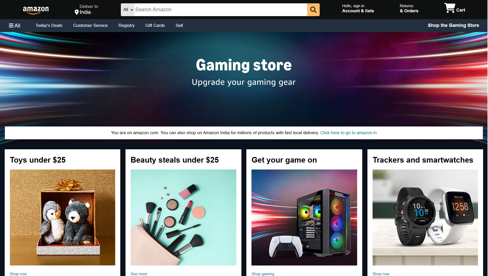

# Amazon Homepage Clone

A static recreation of the Amazon homepage built using HTML and CSS.

## Technologies Used

- HTML5
- CSS3
- Font Awesome

## Features

- Amazon-style navigation bar
- Search bar
- Hero section
- Product category cards
- Responsive layout
- Footer
- Hover effects

## Purpose

This project was created to practice HTML, CSS,
Flexbox, webpage layout, and responsive design.

## Preview

## Disclaimer

This is a student/educational project and is not
affiliated with or endorsed by Amazon.